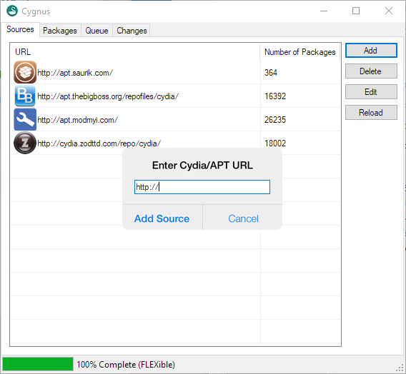
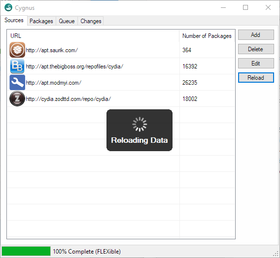
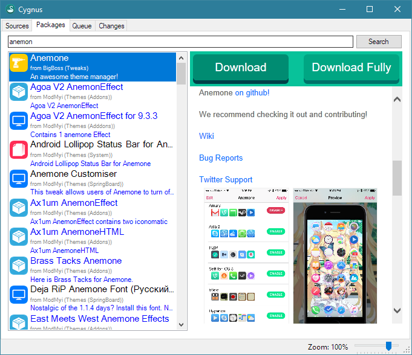
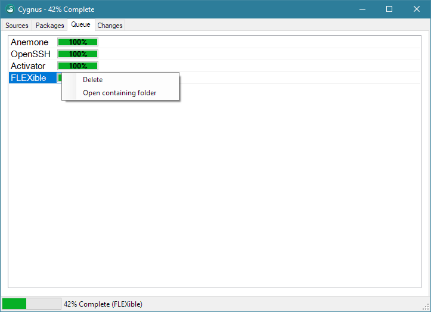

# &nbsp;Cygnus 

Cydia-like APT Client for Windows.

Similarly to Cyder2, it allows you to download Cydia packages directly from your desktop, while at the same time aiming for a more user friendly experience by imitating Cydia user interface.

## Usage

### Sources

+ Starting from 0.6, Cygnus will ask if you want to add default repositories when it's opened for the first time.
+ You can add, delete or edit repositories easily.
+ Reload button is manually pressed unlike Cydia where it's automatically executed each time it's opened. What it does is basically updating repositories. Use this button if you want to stay up-to-date.

### Packages

+ You can search packages at the top, clicking a package will load its depiction at the right side. You can resize the tabs.
+ If for some reason, the depiction is too big, you can zoom-in and out from the bottom-right side.
+ **Download** button will download the package itself, whereas **Download Fully** button will also include the dependencies. The reason it was worded this way was because the word dependency is too long to fit.
+ The paid packages will be highlighted as blue. Before 0.6, you could download the packages that you own, provided that you entered your UUID on the settings page. This was removed due to the piracy concerns.

### Queue

+ This page was going to be revamped but due to lack of motivation and time, it was abandoned, so it uses its space a bit inefficiently.
+ Here you can see your packages downloaded one at a time. After they are downloaded, you can right click and see where they are downloaded.
+ If you pressed **Download Fully** button, the folder will also include the dependendencies.

# Disclaimer

This project is discontinued due to lack of time.
